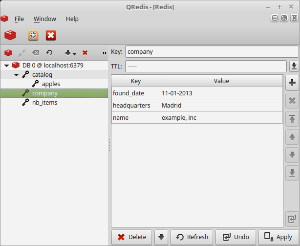

# QRedis

A [Python](http://www.python.org/), [Qt](http://www.qt.io/)
based [Redis](http://redis.io) client user interface.



## Help wanted

Open to people who want to colaborate.

- Would like to know which features you would like to have
- Pull requests are welcome
- You can always open an issue saying you want to be part of the team

## Installation

```console
$ pip install qredis
```

## Requirements

- Python >= 3.5
- [PyQt](http://riverbankcomputing.com/software/pyqt) 5
  (or in the future PySide)
- [redis-py](https://github.com/andymccurdy/redis-py)

## Usage

```console
$ qredis with no DB loaded on startup
$ qredis

$ connect to localhost:6379, db=0
$ qredis -p 6379

$ connect with unix socket, db=5
$ qredis -s /tmp/redis.sock -n 5
```

**That's all folks!**
